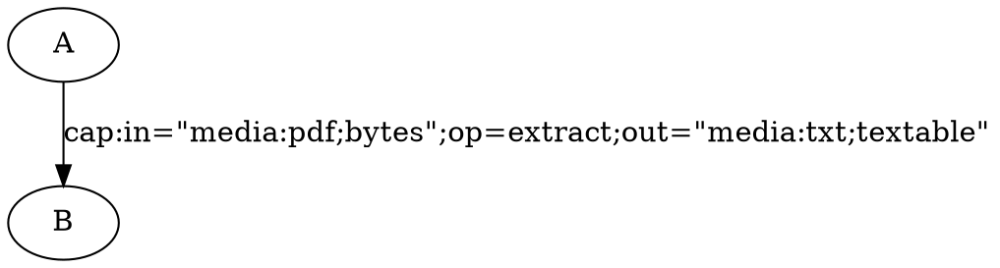

# Macino

Macino is a Rust library that parses DOT digraphs and interprets edge labels starting with `cap:` as Cap URNs. It resolves each Cap URN via a CapNS registry, validates the graph, and produces a validated, executable DAG IR (Intermediate Representation).

## Features

- **DOT Graph Parsing**: Uses the `dot-parser` crate to parse DOT digraphs according to the Graphviz grammar
- **CapNS Integration**: Resolves Cap URNs via CapNS registry and validates them
- **Media URN Derivation**: Automatically derives node media URNs from incident cap definitions
- **DAG Validation**: Enforces that the graph is a DAG (no cycles) using topological sort
- **Strict Validation**: Fails hard on any invalid input or inconsistency
- **Type-Safe IR**: Produces a strongly-typed resolved graph structure ready for execution

## Core Concepts

### Cap URNs in DOT Graphs

Macino interprets DOT edge labels that start with `cap:` as Cap URNs. Each cap has:
- An `in` specification: the input media URN
- An `out` specification: the output media URN
- Additional tags defining the operation (e.g., `op=extract`)

Example:


### Node Media URN Derivation

Macino derives the media URN of each DOT node from the caps connected to it:
- The source node of an edge gets the cap's `in` media URN
- The target node of an edge gets the cap's `out` media URN
- If a node appears in multiple edges, all incident caps must agree on its media URN (otherwise: hard error)

## Usage

```rust
use macino::{parse_dot_to_cap_dag, CapRegistryTrait};
use capns::CapRegistry;

#[tokio::main]
async fn main() -> Result<(), Box<dyn std::error::Error>> {
    // Create a CapNS registry
    let registry = CapRegistry::new().await?;

    // Parse DOT with cap URNs
    let dot = r#"
        digraph pipeline {
            input -> extracted [label="cap:in=\"media:pdf;bytes\";op=extract;out=\"media:txt;textable\""];
            extracted -> summary [label="cap:in=\"media:txt;textable\";op=summarize;out=\"media:txt;textable\""];
        }
    "#;

    // Parse and validate
    let graph = parse_dot_to_cap_dag(dot, &registry).await?;

    // Access resolved information
    println!("Graph has {} nodes and {} edges",
             graph.nodes.len(),
             graph.edges.len());

    for (node_id, media_urn) in &graph.nodes {
        println!("Node '{}': {}", node_id, media_urn);
    }

    for edge in &graph.edges {
        println!("Edge: {} --[{}]--> {}",
                 edge.from,
                 edge.cap_urn,
                 edge.to);
    }

    Ok(())
}
```

## License

MIT

## Execution

Macino not only parses and validates DOT graphs, but also executes them by:
1. Discovering plugins that provide the required caps via filegrind.com/api/plugins
2. Downloading and caching plugins locally
3. Executing the DAG in topological order
4. Passing data between nodes

### Execute a DAG

```bash
cargo run --example execute_dag examples/pdf-processing.dot pdf_input:/path/to/file.pdf
```

This will:
1. Parse and validate the DOT file
2. Query the plugin registry for caps
3. Download required plugins to `~/.macino/plugins/`
4. Execute each cap in order
5. Display the results

### Plugin Management

Plugins are:
- Downloaded from `https://filegrind.com/api/plugins`
- Cached in `~/.macino/plugins/`
- Executed using the PluginHost protocol
- Invoked via CBOR frames over stdin/stdout

### Architecture

```
DOT File → Parser → ResolvedGraph → Executor → Results
                ↓                        ↓
            CapNS Registry      Plugin Discovery
                                       ↓
                                Plugin Download
                                       ↓
                                 PluginHost
```

